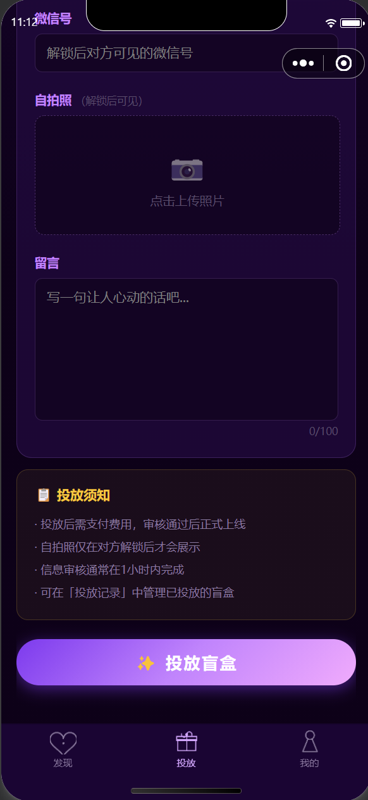

<div align="center">

# 🎁 盲盒交友小程序

**一款基于 uni-app 开发的微信小程序 — 通过「盲盒」机制匿名交友，解锁心动瞬间**

[](https://uniapp.dcloud.net.cn/)
[](https://developers.weixin.qq.com/miniprogram/)
[](LICENSE)
[](manifest.json)

</div>

---

## 📖 项目简介

盲盒交友小程序将「盲盒」的惊喜感与社交交友结合，用户可以将自己的信息投放到「盲盒」中，其他用户消耗解锁次数后随机解锁，从而产生双向匿名交友的趣味体验。整个项目基于 [API工厂](https://www.it120.cc/) 后端服务驱动，无需自建服务器，开箱即用。

---

## 📸 页面截图

<table>
  <tr>
    <td align="center"><b>启动页</b></td>
    <td align="center"><b>登录页</b></td>
    <td align="center"><b>发现页</b></td>
    <td align="center"><b>投放盲盒</b></td>
    <td align="center"><b>投放盲盒（续）</b></td>
  </tr>
  <tr>
    <td></td>
    <td></td>
    <td></td>
    <td></td>
    <td></td>
  </tr>
</table>

<table>
  <tr>
    <td align="center"><b>我的</b></td>
    <td align="center"><b>充值解锁次数</b></td>
    <td align="center"><b>解锁记录</b></td>
    <td align="center"><b>投放记录</b></td>
    <td align="center"><b>用户协议</b></td>
  </tr>
  <tr>
    <td></td>
    <td></td>
    <td></td>
    <td></td>
    <td></td>
  </tr>
</table>

---

## ✨ 功能特性

| 模块 | 功能说明 |
|------|---------|
| 🚀 启动页 | 品牌引导动画，流畅进入主流程 |
| 🔐 登录 | 微信一键授权登录，安全快捷 |
| 🔍 发现 | 浏览已投放的盲盒列表，随机解锁结识陌生人 |
| 📦 投放盲盒 | 填写个人信息，将自己放入盲盒池中 |
| 👤 个人中心 | 查看账户信息、余额、签到、编辑资料 |
| 💰 余额充值 | 在线购买解锁次数，支持微信支付 |
| 📋 解锁记录 | 查看历史解锁的盲盒详情 |
| 📋 投放记录 | 查看自己投放盲盒的被解锁情况 |
| 🔑 账号安全 | 修改密码、账号绑定等安全设置 |
| 📝 用户协议 | 规范的隐私政策与服务协议 |
| 📅 每日签到 | 连续签到奖励积分/解锁次数 |

---

## 🛠️ 技术栈

- **框架**：[uni-app](https://uniapp.dcloud.net.cn/) (Vue 3)
- **目标平台**：微信小程序 / H5
- **后端服务**：[API工厂](https://www.it120.cc/) — `apifm-uniapp ^26.7.26`
- **工具库**：[dayjs](https://day.js.org/) 日期处理
- **海报生成**：[lime-painter](https://github.com/liangei/lime-painter) 分享海报绘制

---

## 🚀 快速开始

### 环境准备

| 工具 | 版本要求 | 下载地址 |
|------|---------|---------|
| HBuilderX | ≥ 4.0 | [下载](https://www.dcloud.io/hbuilderx.html) |
| 微信开发者工具 | 最新稳定版 | [下载](https://developers.weixin.qq.com/miniprogram/dev/devtools/download.html) |
| Node.js | ≥ 16 | [下载](https://nodejs.org/) |

---

### 第一步：克隆项目

```bash
git clone https://github.com/your-username/your-repo.git
cd your-repo
```

---

### 第二步：安装依赖

```bash
npm install
```

---

### 第三步：⚠️ 必须修改配置（否则无法运行）

#### 3.1 修改 `config.js` — API工厂域名和商户ID

打开根目录下的 `config.js`，将 `subDomain` 和 `merchantId` 替换为你自己在 [API工厂](https://www.it120.cc/) 注册后获得的值：

```js
// config.js
const config = {
  subDomain: 'your-subdomain',   // ⚠️ 改成你自己的子域名
  merchantId: 123456,             // ⚠️ 改成你自己的商户ID
}
```

> 登录 [API工厂后台](https://admin.s2m.cc) → 个人中心 → 即可找到你的子域名和商户ID。

---

#### 3.2 修改 `manifest.json` — 微信小程序 AppID

打开 `manifest.json`，找到 `mp-weixin` 节点，将 `appid` 替换为你自己微信小程序的 AppID：

```json
"mp-weixin": {
  "appid": "your-wx-appid",   // ⚠️ 改成你自己的微信小程序 AppID
  "setting": {
    "urlCheck": false
  },
  "usingComponents": true
}
```

> 在 [微信公众平台](https://mp.weixin.qq.com/) 注册小程序后，进入「开发管理 → 开发设置」即可获取 AppID。

---

### 第四步：运行项目

**微信小程序（开发调试）**

```bash
npm run dev:mp-weixin
```

然后打开「微信开发者工具」，导入 `dist/dev/mp-weixin` 目录即可预览。

**H5 模式（浏览器调试）**

```bash
npm run dev:h5
```

**生产构建**

```bash
# 微信小程序
npm run build:mp-weixin

# H5
npm run build:h5
```

---

## 📂 项目结构

```
盲盒交友/
├── common/              # 公共工具函数（auth、支付、导航栏等）
├── components/          # 全局组件
│   └── nav-bar/         # 自定义导航栏组件
├── pages/               # 页面目录
│   ├── start/           # 启动页
│   ├── index/           # 发现页（首页）
│   ├── login/           # 登录页
│   ├── push/            # 投放盲盒
│   ├── push-logs/       # 投放记录
│   ├── unlock-logs/     # 解锁记录
│   ├── recharge/        # 购买解锁次数
│   ├── agreement/       # 用户协议
│   └── user/            # 个人中心相关页面
├── static/              # 静态资源（图片、图标）
├── store/               # Vuex 状态管理
├── uni_modules/         # uni-app 插件模块
├── config.js            # ⚠️ API工厂配置（必须修改）
├── manifest.json        # ⚠️ 小程序 AppID 配置（必须修改）
├── pages.json           # 页面路由与 TabBar 配置
└── App.vue              # 应用入口
```

---

## ⚙️ 后端配置说明

本项目后端采用 [API工厂](https://www.it120.cc/) SaaS 服务，无需自建服务器。

1. 前往 [API工厂官网](https://www.it120.cc/) 注册账号
2. 创建应用，获取 **子域名（subDomain）** 和 **商户ID（merchantId）**
3. 在后台配置用户体系、商品（解锁套餐）、订单等数据
4. 将以上信息填入 `config.js` 即可完成对接

详细文档：[https://www.yuque.com/apifm/nu0f75/cdqz1n](https://www.yuque.com/apifm/nu0f75/cdqz1n)

---

## 📋 常见问题

**Q：运行后提示"商户不存在"或接口报错？**
> 检查 `config.js` 中的 `subDomain` 和 `merchantId` 是否已替换为你自己的值。

**Q：微信开发者工具提示 AppID 不匹配？**
> 确认 `manifest.json` 中 `mp-weixin.appid` 已改为你自己在微信公众平台申请的 AppID。

**Q：支付功能无法使用？**
> 需要在 API工厂后台绑定微信支付商户号，并确保小程序已通过微信审核上线。

**Q：dist 目录不存在？**
> 先执行 `npm run dev:mp-weixin` 构建一次，dist 目录会自动生成。

---

## 🌟 其他优秀开源模板推荐

- [天使童装](https://github.com/EastWorld/wechat-app-mall) / [码云镜像](https://gitee.com/javazj/wechat-app-mall) / [GitCode镜像](https://gitcode.com/gooking2/wechat-app-mall)
- [天使童装（uni-app版本）](https://github.com/gooking/uni-app-mall) / [码云镜像](https://gitee.com/javazj/uni-app-mall) / [GitCode镜像](https://gitcode.com/gooking2/uni-app-mall)
- [简约精品商城（uni-app版本）](https://github.com/gooking/uni-app--mini-mall) / [码云镜像](https://gitee.com/javazj/uni-app--mini-mall) / [GitCode镜像](https://gitcode.com/gooking2/uni-app--mini-mall)
- [舔果果小铺（升级版）](https://github.com/gooking/TianguoguoXiaopu)
- [面馆风格小程序](https://gitee.com/javazj/noodle_shop_procedures)
- [AI名片](https://github.com/gooking/visitingCard) / [码云镜像](https://gitee.com/javazj/visitingCard) / [GitCode镜像](https://gitcode.com/gooking2/visitingCard)
- [仿海底捞订座排队 (uni-app)](https://github.com/gooking/dingzuopaidui) / [码云镜像](https://gitee.com/javazj/dingzuopaidui) / [GitCode镜像](https://gitcode.com/gooking2/dingzuopaidui)
- [H5版本商城/餐饮](https://github.com/gooking/vueMinishop) / [码云镜像](https://gitee.com/javazj/vueMinishop) / [GitCode镜像](https://gitcode.com/gooking2/vueMinishop)
- [餐饮点餐](https://github.com/woniudiancang/bee) / [码云镜像](https://gitee.com/woniudiancang/bee) / [GitCode镜像](https://gitcode.com/gooking2/bee)
- [企业微展](https://github.com/gooking/qiyeweizan) / [码云镜像](https://gitee.com/javazj/qiyeweizan) / [GitCode镜像](https://gitcode.com/gooking2/qiyeweizan)
- [无人棋牌室](https://github.com/gooking/wurenqipai) / [码云镜像](https://gitee.com/javazj/wurenqipai) / [GitCode镜像](https://gitcode.com/gooking2/wurenqipai)
- [酒店客房服务小程序](https://github.com/gooking/hotelRoomService) / [码云镜像](https://gitee.com/javazj/hotelRoomService) / [GitCode镜像](https://gitcode.com/gooking2/hotelRoomService)
- [面包店风格小程序](https://github.com/gooking/bread) / [码云镜像](https://gitee.com/javazj/bread) / [GitCode镜像](https://gitcode.com/gooking2/bread)
- [朋友圈发圈素材小程序](https://github.com/gooking/moments) / [码云镜像](https://gitee.com/javazj/moments) / [GitCode镜像](https://gitcode.com/gooking2/moments)
- [小红书企业微展](https://github.com/gooking/xhs-qiyeweizan) / [码云镜像](https://gitee.com/javazj/xhs-qiyeweizan) / [GitCode镜像](https://gitcode.com/gooking2/xhs-qiyeweizan)
- [旧物回收、废品回收](https://github.com/gooking/recycle) / [码云镜像](https://gitee.com/javazj/recycle) / [GitCode镜像](https://gitcode.com/gooking2/recycle)
- [会员卡（饭卡）储值消费系统](https://github.com/gooking/mealcard) / [码云镜像](https://gitee.com/javazj/mealcard) / [GitCode镜像](https://gitcode.com/gooking2/mealcard)
- [盲盒交友 uni-app](https://github.com/gooking/blindBoxDating) / [码云镜像](https://gitee.com/javazj/blindBoxDating) / [GitCode镜像](https://gitcode.com/gooking2/blindBoxDating)

---

## 📄 许可证

本项目基于 [MIT License](LICENSE) 开源，欢迎 Fork、Star 和贡献代码。

---

<div align="center">

如果这个项目对你有帮助，欢迎点个 ⭐ Star 支持一下！

</div>
