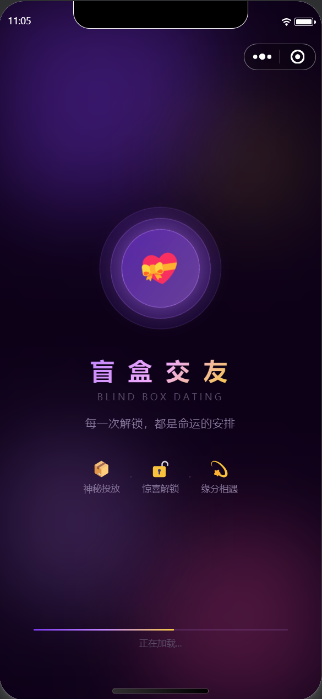
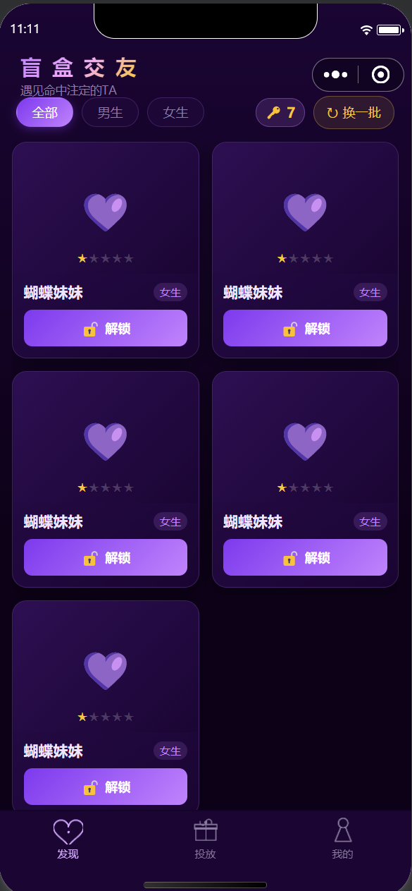
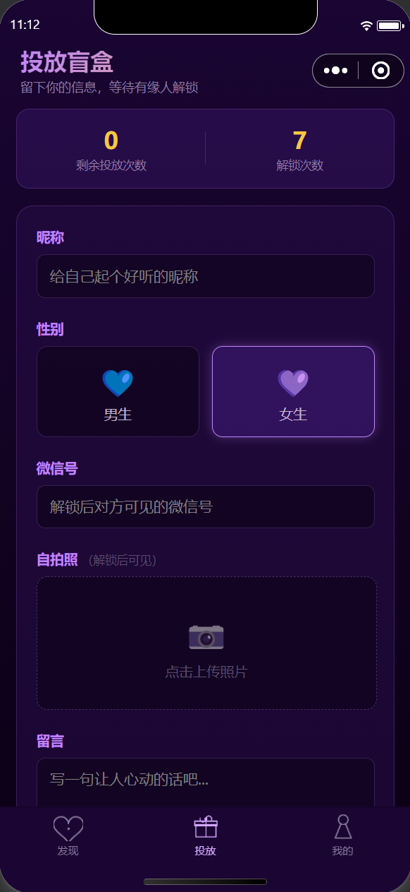
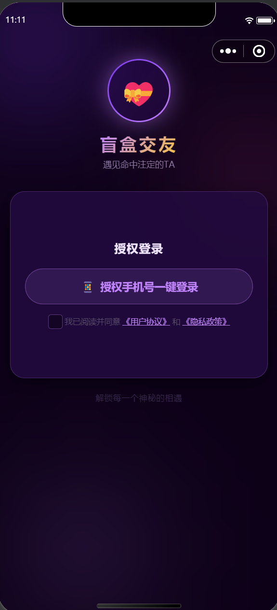
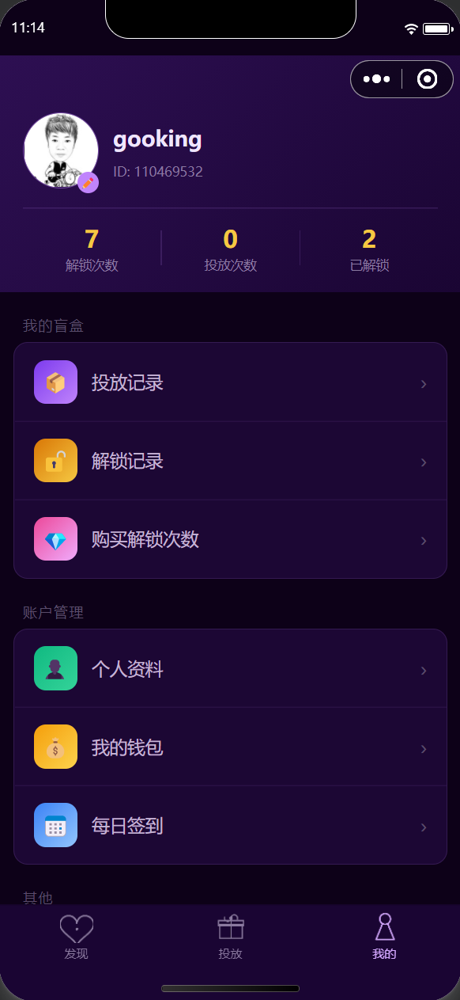
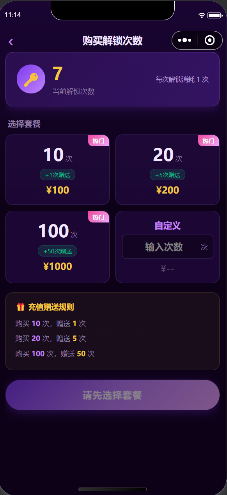
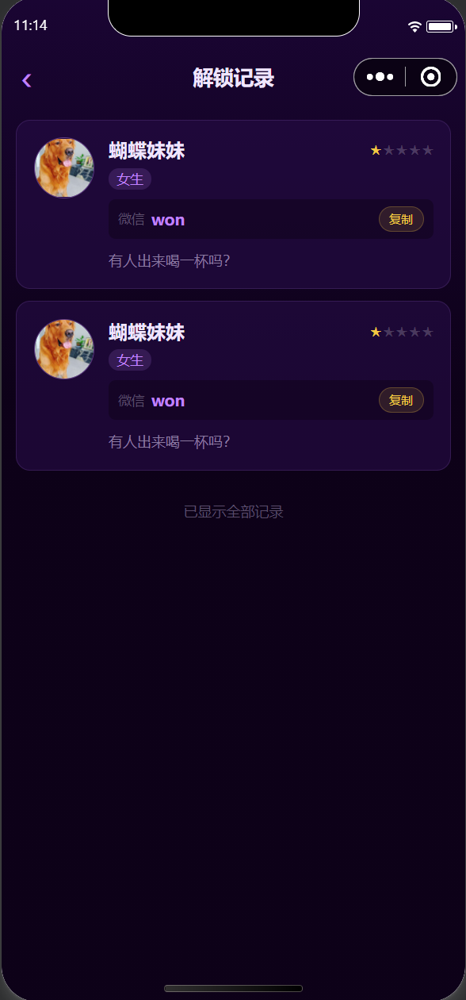
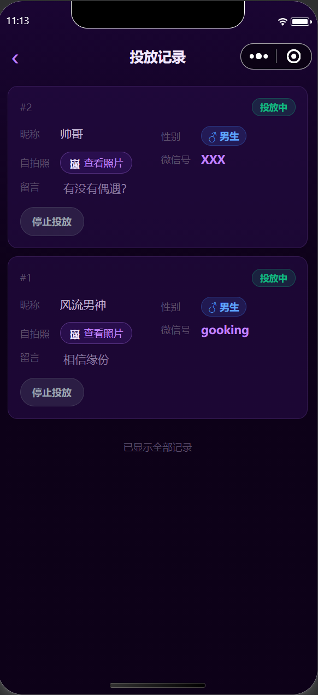
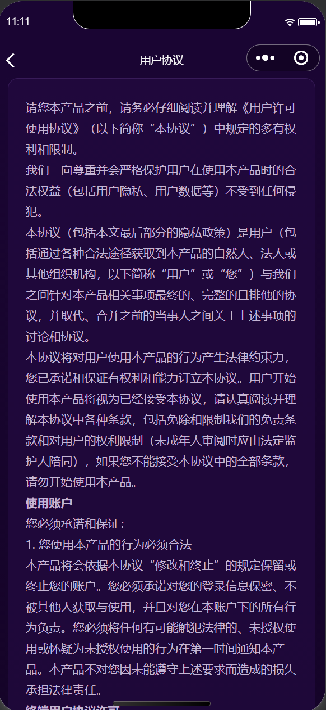

<div align="center">

<br/>


<br/><br/>

**一款基于 uni-app 的微信小程序 — 用「盲盒」遇见命中注定的TA**

<br/>

[](https://uniapp.dcloud.net.cn/)
[](https://developers.weixin.qq.com/miniprogram/)
[](https://www.it120.cc/)
[](LICENSE)
[](manifest.json)

<br/>

</div>

---

## 📱 扫码体验

<div align="center">

<br/>


<br/>

**微信扫描上方二维码，立即体验盲盒交友 + 漂流瓶匿名社交**

<br/>

</div>

---

## 🖼️ 效果截图

<div align="center">

| 启动页 | 发现页 | 投放页 |
|:---:|:---:|:---:|
|  |  |  |
| **登录页** | **个人中心** | **余额充值** |
|  |  |  |
| **解锁记录** | **投放记录** | **用户协议** |
|  |  |  |

</div>

---

## 📖 项目简介

> 盲盒交友小程序将「盲盒」的惊喜感与社交交友完美结合。你可以将自己的信息投放到盲盒中，等待有缘人解锁；也可以向大海投出一个漂流瓶，静候陌生人捡起。整个项目基于 [API工厂](https://www.it120.cc/) 后端服务驱动，**无需自建服务器，开箱即用**。

<br/>

<div align="center">

```
投放盲盒  ──▶  陌生人解锁  ──▶  获得联系方式  ──▶  相识相遇
扔漂流瓶  ──▶  漂向远方    ──▶  陌生人捡起    ──▶  匿名相遇
```

</div>

---

## ✨ 功能特性

<br/>

<div align="center">

| &nbsp; | 模块 | 功能说明 |
|:---:|:---|:---|
| 🚀 | **启动引导** | 品牌动效引导页，流畅进入主流程 |
| 🔐 | **微信登录** | 微信一键授权，安全快捷无需注册 |
| 🔍 | **发现盲盒** | 浏览盲盒列表，按性别筛选，随机解锁结识陌生人 |
| 📦 | **投放盲盒** | 填写昵称/性别/微信/自拍，将自己放入盲盒池 |
| 🍾 | **漂流瓶** | 匿名写下心声投入大海；随机打捞他人漂流瓶，开启奇遇相遇 |
| 👤 | **个人中心** | 账户信息、余额概览、一键跳转各功能入口 |
| 💰 | **余额充值** | 在线购买解锁次数，微信支付快速到账 |
| 📋 | **解锁记录** | 查看历史解锁的所有盲盒详情 |
| 📋 | **投放记录** | 查看自己盲盒的曝光与被解锁情况 |
| 📅 | **每日签到** | 连续签到获得积分/解锁次数奖励 |
| 🔑 | **账号安全** | 修改密码、账号绑定等安全管理 |
| 📝 | **用户协议** | 完整的隐私政策与服务条款 |

</div>

<br/>

> 🍾 **漂流瓶玩法亮点**
> - **扔瓶子**：写下最多 200 字的匿名心声，支持附加地理位置，投放后触发瓶子旋转入海动效
> - **捡瓶子**：点击海洋场景随机捡起一只漂流瓶，查看发送者头像、昵称及心声内容
> - 全程匿名，保护隐私，简单有趣

---

## 🛠️ 技术栈

<br/>

<div align="center">

| 分类 | 技术 / 工具 | 说明 |
|:---:|:---|:---|
| 📦 框架 | [uni-app](https://uniapp.dcloud.net.cn/) · Vue 3 | 一套代码多端运行 |
| 🎯 目标平台 | 微信小程序 · H5 | — |
| ☁️ 后端服务 | [API工厂](https://www.it120.cc/) `apifm-uniapp ^26.7.26` | 零服务器成本 |
| 🗃️ 状态管理 | Vuex 4 | 全局用户 Token 持久化 |
| 🖌️ 海报生成 | [lime-painter](https://github.com/liangei/lime-painter) | Canvas 分享海报绘制 |
| 🛠️ 工具脚本 | Node.js（`scripts/gen-icons.js`）| 纯代码生成 TabBar PNG 图标 |

</div>

---

## 🚀 快速开始

### 一、环境准备

<br/>

<div align="center">

| 工具 | 版本要求 | 下载 |
|:---|:---:|:---:|
| HBuilderX | ≥ 4.0 | [→ 下载](https://www.dcloud.io/hbuilderx.html) |
| 微信开发者工具 | 最新稳定版 | [→ 下载](https://developers.weixin.qq.com/miniprogram/dev/devtools/download.html) |
| Node.js | ≥ 16 | [→ 下载](https://nodejs.org/) |

</div>

<br/>

### 二、克隆项目

```bash
git clone https://github.com/your-username/your-repo.git
cd your-repo
npm install
```

---

### 三、⚠️ 必须修改的配置项

> 以下两项必须替换为你自己的值，否则项目无法正常运行。

<br/>

**3.1 修改 `config.js` — API工厂子域名与商户 ID**

```js
// config.js
const config = {
  subDomain: 'your-subdomain',   // ⚠️ 改成你在 API工厂注册的子域名
  merchantId: 123456,             // ⚠️ 改成你自己的商户 ID
}
```

> 登录 [API工厂后台](https://admin.s2m.cc) → 个人中心 → 获取子域名和商户 ID。

<br/>

**3.2 修改 `manifest.json` — 微信小程序 AppID**

```json
"mp-weixin": {
  "appid": "your-wx-appid",   // ⚠️ 改成你自己的微信小程序 AppID
  "setting": { "urlCheck": false },
  "usingComponents": true
}
```

> 进入 [微信公众平台](https://mp.weixin.qq.com/) → 开发管理 → 开发设置 → 获取 AppID。

---

### 四、运行项目

```bash
# 微信小程序（开发调试）
npm run dev:mp-weixin
# → 用微信开发者工具导入 dist/dev/mp-weixin 目录

# H5 模式（浏览器调试）
npm run dev:h5

# 生产构建
npm run build:mp-weixin
npm run build:h5
```

---

## 📂 项目结构

```
盲盒交友/
├── common/                  # 公共工具（auth、支付、导航栏适配）
├── components/
│   └── nav-bar/             # 自定义导航栏（适配胶囊按钮）
├── pages/
│   ├── start/               # 🚀 启动引导页
│   ├── index/               # 🔍 发现页（盲盒列表 + 解锁）
│   ├── login/               # 🔐 微信登录
│   ├── push/                # 📦 投放盲盒
│   ├── drift-bottle/        # 🍾 漂流瓶（扔瓶子 / 捡瓶子）
│   ├── push-logs/           # 📋 投放记录
│   ├── unlock-logs/         # 📋 解锁记录
│   ├── recharge/            # 💳 购买解锁次数
│   ├── agreement/           # 📝 用户协议
│   └── user/                # 👤 个人中心及子页面
├── scripts/
│   └── gen-icons.js         # 🖼️ TabBar 图标生成脚本（Node.js）
├── static/                  # 静态资源（图标、图片）
├── store/                   # Vuex 状态管理
├── uni_modules/             # uni-app 插件模块
├── config.js                # ⚠️ API工厂配置（必须修改）
├── manifest.json            # ⚠️ 小程序 AppID（必须修改）
├── pages.json               # 页面路由 & TabBar 配置
└── App.vue                  # 应用入口
```

---

## ⚙️ 后端配置说明

本项目后端完全采用 [API工厂](https://www.it120.cc/) SaaS 服务，**无需自建服务器**。

1. 前往 [API工厂官网](https://www.it120.cc/) 注册账号
2. 创建应用，获取 **子域名（subDomain）** 和 **商户ID（merchantId）**
3. 在后台配置用户体系、解锁套餐商品、漂流瓶功能模块等
4. 将配置填入 `config.js` 即可完成全部对接

📚 完整接口文档：[https://www.yuque.com/apifm/nu0f75/cdqz1n](https://www.yuque.com/apifm/nu0f75/cdqz1n)

---

## ❓ 常见问题

<details>
<summary><b>Q：运行后提示「商户不存在」或接口报错？</b></summary>

检查 `config.js` 中的 `subDomain` 和 `merchantId` 是否已替换为你自己在 API工厂注册的值。

</details>

<details>
<summary><b>Q：微信开发者工具提示 AppID 不匹配？</b></summary>

确认 `manifest.json` 中 `mp-weixin.appid` 已改为你自己在微信公众平台申请的 AppID。

</details>

<details>
<summary><b>Q：支付功能无法使用？</b></summary>

需要在 API工厂后台绑定微信支付商户号，并确保小程序已通过微信审核上线。

</details>

<details>
<summary><b>Q：漂流瓶显示「大海里暂无漂流瓶」？</b></summary>

漂流瓶功能需要先有用户扔瓶子才能捡到。请先切换到「扔瓶子」Tab 投放一条内容，再尝试捡瓶子。

</details>

<details>
<summary><b>Q：dist 目录不存在？</b></summary>

先执行 `npm run dev:mp-weixin` 进行一次构建，dist 目录会自动生成。

</details>

---

## 🌟 更多优质开源模板

<div align="center">

| 项目名称 | GitHub | 码云 | GitCode |
|:---|:---:|:---:|:---:|
| 天使童装 | [→](https://github.com/EastWorld/wechat-app-mall) | [→](https://gitee.com/javazj/wechat-app-mall) | [→](https://gitcode.com/gooking2/wechat-app-mall) |
| 天使童装（uni-app） | [→](https://github.com/gooking/uni-app-mall) | [→](https://gitee.com/javazj/uni-app-mall) | [→](https://gitcode.com/gooking2/uni-app-mall) |
| 简约精品商城（uni-app） | [→](https://github.com/gooking/uni-app--mini-mall) | [→](https://gitee.com/javazj/uni-app--mini-mall) | [→](https://gitcode.com/gooking2/uni-app--mini-mall) |
| 舔果果小铺（升级版） | [→](https://github.com/gooking/TianguoguoXiaopu) | — | — |
| 面馆风格小程序 | — | [→](https://gitee.com/javazj/noodle_shop_procedures) | — |
| AI 名片 | [→](https://github.com/gooking/visitingCard) | [→](https://gitee.com/javazj/visitingCard) | [→](https://gitcode.com/gooking2/visitingCard) |
| 仿海底捞订座排队（uni-app） | [→](https://github.com/gooking/dingzuopaidui) | [→](https://gitee.com/javazj/dingzuopaidui) | [→](https://gitcode.com/gooking2/dingzuopaidui) |
| H5 版本商城 / 餐饮 | [→](https://github.com/gooking/vueMinishop) | [→](https://gitee.com/javazj/vueMinishop) | [→](https://gitcode.com/gooking2/vueMinishop) |
| 餐饮点餐 | [→](https://github.com/woniudiancang/bee) | [→](https://gitee.com/woniudiancang/bee) | [→](https://gitcode.com/gooking2/bee) |
| 企业微展 | [→](https://github.com/gooking/qiyeweizan) | [→](https://gitee.com/javazj/qiyeweizan) | [→](https://gitcode.com/gooking2/qiyeweizan) |
| 无人棋牌室 | [→](https://github.com/gooking/wurenqipai) | [→](https://gitee.com/javazj/wurenqipai) | [→](https://gitcode.com/gooking2/wurenqipai) |
| 酒店客房服务小程序 | [→](https://github.com/gooking/hotelRoomService) | [→](https://gitee.com/javazj/hotelRoomService) | [→](https://gitcode.com/gooking2/hotelRoomService) |
| 面包店风格小程序 | [→](https://github.com/gooking/bread) | [→](https://gitee.com/javazj/bread) | [→](https://gitcode.com/gooking2/bread) |
| 朋友圈发圈素材 | [→](https://github.com/gooking/moments) | [→](https://gitee.com/javazj/moments) | [→](https://gitcode.com/gooking2/moments) |
| 小红书企业微展 | [→](https://github.com/gooking/xhs-qiyeweizan) | [→](https://gitee.com/javazj/xhs-qiyeweizan) | [→](https://gitcode.com/gooking2/xhs-qiyeweizan) |
| 旧物 / 废品回收 | [→](https://github.com/gooking/recycle) | [→](https://gitee.com/javazj/recycle) | [→](https://gitcode.com/gooking2/recycle) |
| 会员卡（饭卡）储值消费 | [→](https://github.com/gooking/mealcard) | [→](https://gitee.com/javazj/mealcard) | [→](https://gitcode.com/gooking2/mealcard) |
| 静筑 Apistatic | [→](https://github.com/gooking/apistatic) | [→](https://gitee.com/javazj/apistatic) | [→](https://gitcode.com/gooking2/apistatic) |
| 盲盒交友 | [→](https://github.com/gooking/blindBoxDating) | [→](https://gitee.com/javazj/blindBoxDating) | [→](https://gitcode.com/gooking2/blindBoxDating) |
| 光影集市 | [→](https://github.com/gooking/photo-trading) | [→](https://gitee.com/javazj/photo-trading) | [→](https://gitcode.com/gooking2/photo-trading) |

</div>

---

## 📄 许可证

本项目基于 [MIT License](LICENSE) 开源，欢迎 Fork、Star 和贡献代码。

---

<div align="center">

<br/>

如果这个项目对你有帮助，欢迎点个 ⭐ **Star** 支持一下！

<br/>

[](https://github.com/gooking/blindBoxDating)

<br/>

*Made with ❤️ · Powered by [API工厂](https://www.it120.cc/)*

<br/>

</div>
